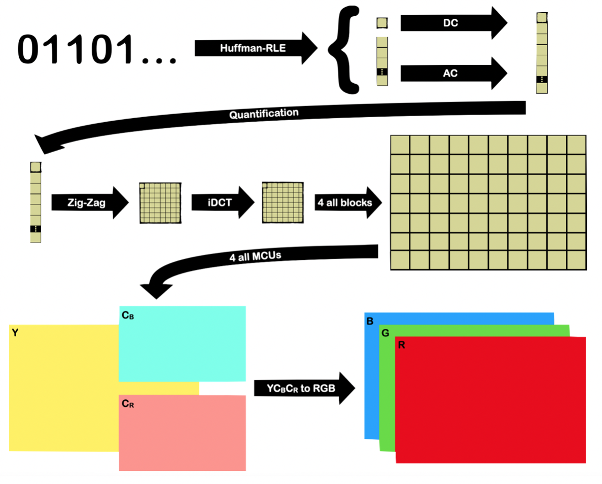

# Notre décodeur JPEG à nous --> team2 !
<i>AZMATALLY Rayan - REBOUL Lucien - DUHAMEL Alexandre</i>

<h1>
[Présentation Projet](https://docs.google.com/presentation/d/1Yj3CBW9zn-ZVlyK9ALZ_Vr0YKK7EV3My2km1zanqT2U/edit?usp=sharing)
</h1>

<h3><u> Liens utiles : </u></h3>
• [Site cours JPEG](https://formationc.pages.ensimag.fr/projet/jpeg/jpeg/)

• [Trello](https://trello.com/invite/b/QCWmCCeJ/ATTIda034d1cb78996e82ba7fbefe8b2bf04D30FF530/taches)

<h4>Une image vaut mille mots... en voilà 2 !</h4>
 

# Autres liens utiles

- Bien former ses messages de commits : [https://www.conventionalcommits.org/en/v1.0.0/](https://www.conventionalcommits.org/en/v1.0.0/) ;
- Problème relationnel au sein du groupe ? Contactez [Pascal](https://fr.wikipedia.org/wiki/Pascal,_le_grand_fr%C3%A8re) !
- Besoin de prendre l'air ? Le [Mont Rachais](https://fr.wikipedia.org/wiki/Mont_Rachais) est accessible à pieds depuis la salle E301 !
- Un peu juste sur le projet à quelques heures de la deadline ? Le [Montrachet](https://www.vinatis.com/achat-vin-puligny-montrachet) peut faire passer l'envie à vos profs de vous mettre une tôle !
